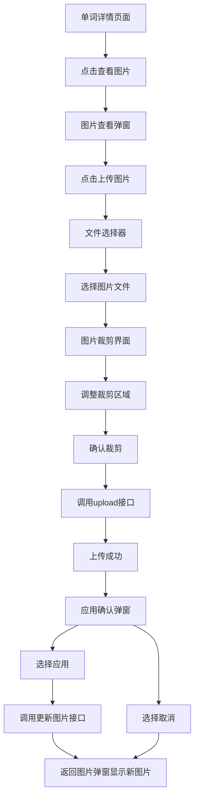

# Dictionary图片上传功能 - 产品需求文档

## 1. 产品概述

为Dictionary.vue词典页面的单词详情图片查看功能增加用户自定义上传图片能力，让用户可以为单词的不同词性上传个性化的图片，提升学习体验和记忆效果。

- 解决问题：当前只能通过AI生成图片，用户无法上传自己喜欢的图片来辅助记忆单词
- 目标用户：使用英语学习应用的所有注册用户
- 产品价值：提升用户参与度和个性化学习体验，增强单词记忆效果

## 2. 核心功能

### 2.1 用户角色
| 角色 | 注册方法 | 核心权限 |
|------|----------|----------|
| 注册用户 | 已有的用户注册系统 | 可以查看、生成和上传单词图片 |

### 2.2 功能模块

本需求主要涉及以下页面的功能增强：
1. **单词详情页面**：在现有图片查看弹窗基础上增加上传图片功能
2. **图片裁剪页面**：新增图片裁剪界面，支持1024x1024尺寸裁剪

### 2.3 页面详情

| 页面名称 | 模块名称 | 功能描述 |
|----------|----------|----------|
| 单词详情页面 | 图片查看弹窗 | 在现有"生成图片"按钮旁增加"上传图片"按钮 |
| 图片裁剪页面 | 文件选择器 | 根据设备类型自适应打开文件选择（Windows文件选择框/手机相册） |
| 图片裁剪页面 | 图片裁剪工具 | 提供1024x1024裁剪框，支持拖拽调整裁剪区域 |
| 图片裁剪页面 | 上传确认 | 裁剪完成后显示预览，确认上传到服务器 |
| 单词详情页面 | 应用确认弹窗 | 上传成功后询问是否应用新图片，应用后更新单词图片 |

## 3. 核心流程

### 用户操作流程：
1. 用户在单词详情页面点击"查看图片"
2. 在图片弹窗中点击"上传图片"按钮
3. 系统打开文件选择器（Windows文件选择框或手机相册）
4. 用户选择图片文件
5. 进入图片裁剪界面，显示1024x1024裁剪框
6. 用户拖拽调整裁剪区域
7. 点击"确认裁剪"按钮
8. 系统调用upload接口上传裁剪后的图片
9. 上传成功后显示"是否应用"确认弹窗
10. 用户选择应用后，系统调用更新单词图片接口
11. 返回图片查看弹窗，显示新上传的图片

## 4. 用户界面设计

### 4.1 设计风格
- 主色调：沿用现有的蓝色主题色 (#1989fa)
- 按钮样式：圆角按钮，与现有"生成图片"按钮保持一致
- 字体：使用系统默认字体，14px-16px
- 布局风格：卡片式布局，与现有弹窗风格保持一致
- 图标风格：使用Vant组件库的图标系统

### 4.2 页面设计概览

| 页面名称 | 模块名称 | UI元素 |
|----------|----------|---------|
| 图片查看弹窗 | 操作按钮区 | 在"生成图片"按钮右侧添加"上传图片"按钮，使用upload图标，主色调蓝色 |
| 图片裁剪界面 | 裁剪工具 | 1024x1024正方形裁剪框，支持拖拽调整，背景半透明遮罩，裁剪框边框为白色2px |
| 图片裁剪界面 | 操作按钮 | 底部固定"取消"和"确认裁剪"按钮，确认按钮为主色调 |
| 应用确认弹窗 | 确认对话框 | 简洁的确认对话框，包含"取消"和"应用"按钮 |

### 4.3 响应式设计
- 移动端优先设计，支持触摸操作
- 图片裁剪支持手势缩放和拖拽
- 文件选择器在移动端自动调用相册，桌面端调用文件选择器