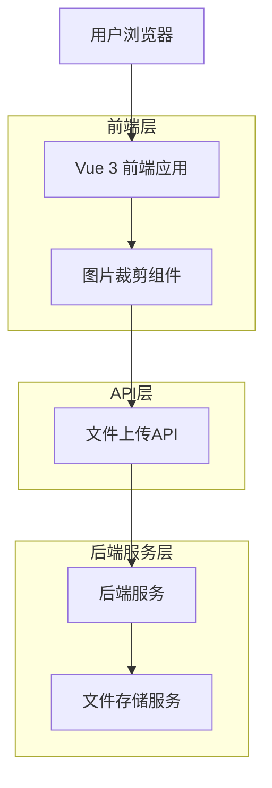
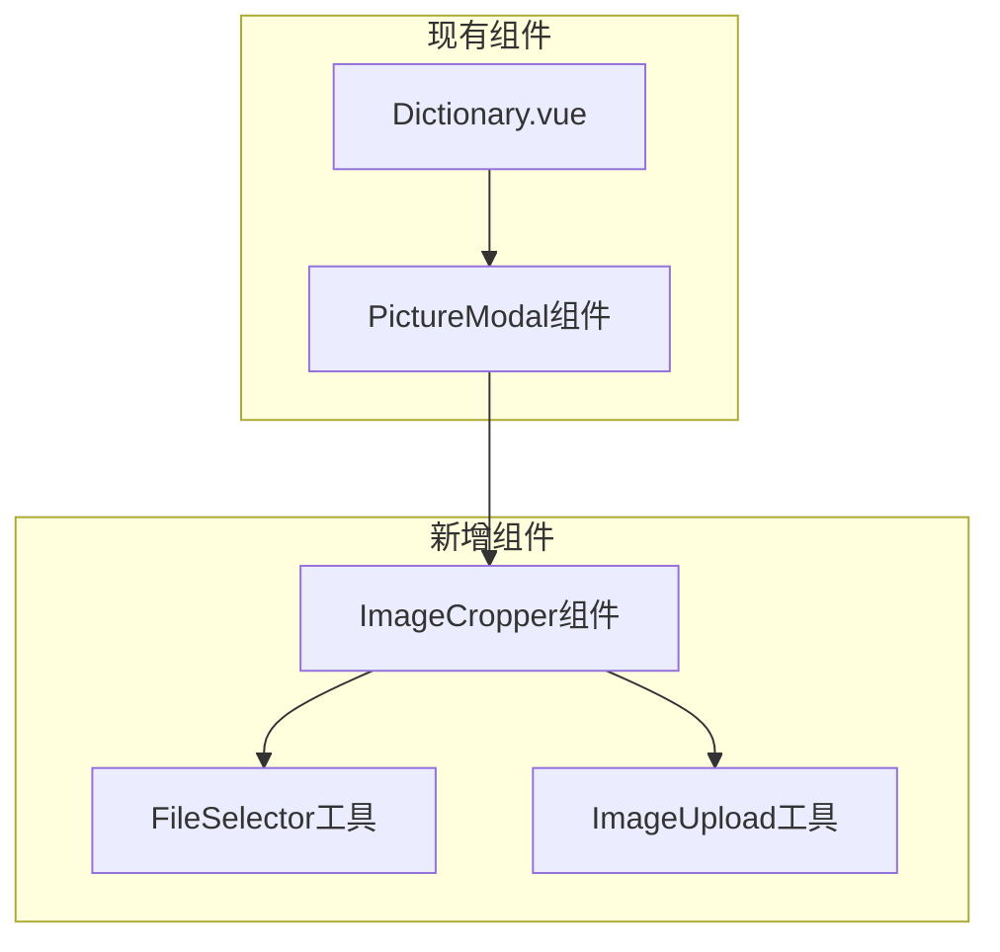

# Dictionary图片上传功能 - 技术架构文档

## 1. 架构设计



## 2. 技术描述

- 前端：Vue@3 + Vant@4 + vue-cropper@1.0.3 + vite
- 后端：现有的文件上传API服务
- 文件存储：现有的对象存储服务（bucket: englishstudy）

## 3. 路由定义

| 路由 | 目的 |
|------|------|
| /dictionary | 词典主页面，包含单词列表和详情 |
| /dictionary/:wordId | 单词详情页面（通过状态管理实现） |

注：图片裁剪功能通过弹窗组件实现，不需要新增路由

## 4. API定义

### 4.1 核心API

文件上传接口（已存在）
```
POST /v1/file/upload
```

Request (FormData):
| 参数名称 | 参数类型 | 是否必需 | 描述 |
|----------|----------|----------|------|
| file | File | true | 裁剪后的图片文件 |
| bucket | string | true | 固定值"englishstudy" |
| object | string | true | 文件路径格式：picture/user_word_{{用户id}}/{{单词全拼}}/{{词性}}_{{时间戳}}.png |

Response:
| 参数名称 | 参数类型 | 描述 |
|----------|----------|------|
| code | number | 响应状态码 |
| message | string | 响应消息 |
| path | string | 上传后的文件路径 |

更新单词图片接口（已存在）
```
POST /api/dictionary/update-picture
```

Request:
| 参数名称 | 参数类型 | 是否必需 | 描述 |
|----------|----------|----------|------|
| word_pos_id | number | true | 单词词性ID |
| picture | string | true | 图片路径 |

Response:
| 参数名称 | 参数类型 | 描述 |
|----------|----------|------|
| code | number | 响应状态码 |
| message | string | 响应消息 |

### 4.2 新增依赖包

需要添加图片裁剪库：
```bash
npm install vue-cropper@1.0.3
```

## 5. 组件架构设计



## 6. 数据模型

### 6.1 组件状态定义

```typescript
// 图片上传相关状态
interface ImageUploadState {
  showCropModal: boolean;          // 是否显示裁剪弹窗
  selectedFile: File | null;       // 选择的原始文件
  croppedImage: string;           // 裁剪后的图片base64
  uploadingImage: boolean;        // 是否正在上传
  showApplyModal: boolean;        // 是否显示应用确认弹窗
  uploadedImagePath: string;      // 上传后的图片路径
}

// 文件上传参数
interface UploadParams {
  bucket: string;                 // 固定为"englishstudy"
  object: string;                 // picture/user_word_{{userId}}/{{word}}/{{pos}}_{{timestamp}}.png
}

// 裁剪配置
interface CropperConfig {
  width: number;                  // 1024
  height: number;                 // 1024
  aspectRatio: number;            // 1:1
  quality: number;                // 0.8
  format: string;                 // 'png'
}
```

### 6.2 文件命名规则

上传文件的object参数格式：
```
picture/user_word_{{userId}}/{{word}}/{{pos}}_{{timestamp}}.png
```

示例：
```
picture/user_word_123/apple/1_1703123456.png
```

其中：
- userId: 从localStorage获取的用户ID
- word: 当前单词的英文全拼
- pos: 词性的数字类型（0-13）
- timestamp: 当前秒级时间戳

## 7. 实现步骤

### 7.1 依赖安装
```bash
npm install vue-cropper@1.0.3
```

### 7.2 组件修改清单

1. **Dictionary.vue主组件**
   - 添加图片裁剪相关的响应式状态
   - 在图片弹窗中添加"上传图片"按钮
   - 实现文件选择、裁剪、上传的完整流程
   - 集成现有的应用图片确认逻辑

2. **新增工具函数**
   - `selectImageFile()`: 文件选择器
   - `generateUploadPath()`: 生成上传路径
   - `cropImageToBlob()`: 图片裁剪转换
   - `uploadUserImage()`: 用户图片上传

3. **样式增强**
   - 图片裁剪弹窗样式
   - 上传按钮样式
   - 响应式布局适配

### 7.3 关键技术点

1. **文件选择器适配**
   - 使用HTML5 File API
   - 移动端自动调用相册
   - 桌面端调用文件选择器

2. **图片裁剪实现**
   - 使用vue-cropper组件
   - 固定1024x1024尺寸
   - 支持拖拽和缩放

3. **文件上传优化**
   - 裁剪后转换为Blob对象
   - 使用FormData上传
   - 添加上传进度提示

4. **错误处理**
   - 文件类型验证
   - 文件大小限制
   - 网络错误处理
   - 用户取消操作处理