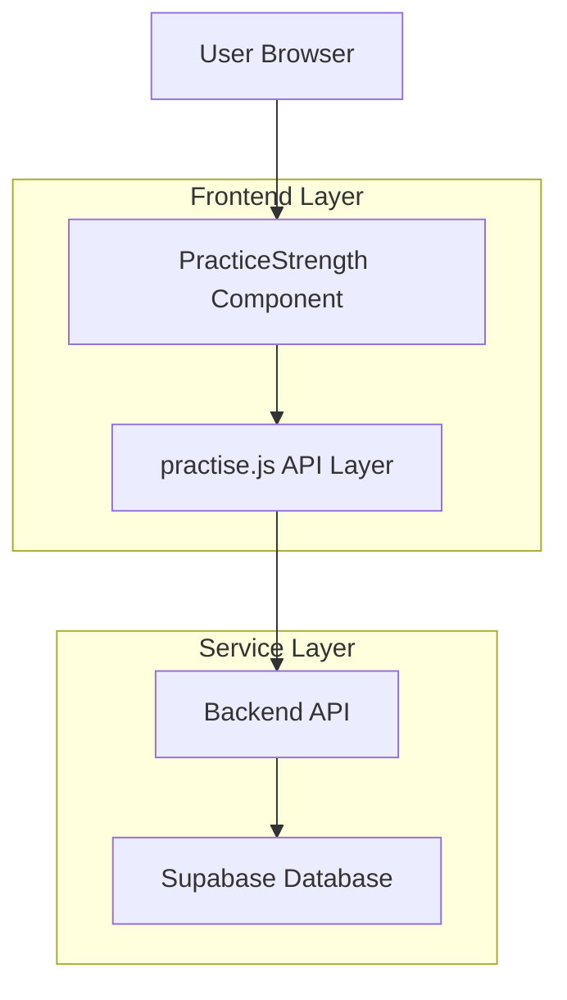

## 1. 架构设计



## 2. 技术栈
- **前端框架**: Vue@3 + Vite
- **UI组件库**: Vant@4
- **状态管理**: Vue Composition API
- **HTTP客户端**: Axios
- **初始化工具**: vite-init

## 3. 路由定义

| 路由 | 用途 |
|------|------|
| /practice/strength | 强化练习页面，展示单词卡片和学习交互 |

## 4. 组件结构

### 4.1 PracticeStrength.vue 组件结构
```
PracticeStrength/
├── 顶部导航栏
│   ├── 返回按钮
│   └── 进度指示器
├── 主要内容区域
│   ├── 图片轮播组件
│   │   ├── van-swipe 图片容器
│   │   ├── 左右切换按钮
│   │   └── 图片指示器
│   └── 单词信息展示
│       ├── 中文释义（choice状态）
│       ├── 完整信息（full状态）
│       │   ├── 音标
│       │   ├── 词性
│       │   ├── 例句
│       │   └── 发音按钮
│       └── 图片区域
└── 底部按钮区域
    ├── 选择阶段按钮（choice状态）
    │   ├── 【记得】按钮
    │   └── 【不记得】按钮
    └── 展示阶段按钮（full状态）
        └── 【下一个】按钮
```

### 4.2 状态管理
```typescript
// 核心状态
const strengthState = ref<'choice' | 'full'>('choice')
const currentWordIndex = ref(0)
const wordList = ref<WordCard[]>([])
const loading = ref(false)
const error = ref('')

// 图片轮播状态
const imageSwipeInitial = ref<any>(null)
const imageActiveIndex = ref(0)

// 当前单词数据
const currentWord = computed(() => wordList.value[currentWordIndex.value])
```

## 5. API接口定义

### 5.1 获取强化列表
```
GET /api/strength/list
```

响应数据结构：
```typescript
interface StrengthWordCard {
  id: string
  word: string
  phonetic: string
  audio: string
  translation: string
  partOfSpeech: string
  examples: Array<{
    sentence: string
    translation: string
  }>
  images: string[]
  definition: string
}
```

### 5.2 完成强化
```
POST /api/strength/finish
```

请求参数：
```typescript
interface FinishStrengthReq {
  wordId: string
  operation: 1 | 2  // 1-记得(完成强化), 2-不记得(强化失败)
}
```

响应数据：
```typescript
interface FinishStrengthRes {
  success: boolean
  message?: string
}
```

## 6. 核心方法实现

### 6.1 初始化加载
```typescript
const loadStrengthList = async () => {
  loading.value = true
  try {
    const response = await getStrengthWordCardList()
    wordList.value = response.data
    if (wordList.value.length === 0) {
      error.value = '暂无需要强化的单词'
    }
  } catch (err) {
    error.value = '加载失败，请重试'
  } finally {
    loading.value = false
  }
}
```

### 6.2 记忆选择处理
```typescript
const handleMemoryChoice = async (operation: 1 | 2) => {
  try {
    await finishStrength({
      wordId: currentWord.value.id,
      operation
    })
    strengthState.value = 'full'  // 切换到完整展示状态
  } catch (err) {
    showToast('操作失败，请重试')
  }
}
```

### 6.3 下一个单词
```typescript
const nextWord = () => {
  if (currentWordIndex.value < wordList.value.length - 1) {
    currentWordIndex.value++
    strengthState.value = 'choice'  // 重置到选择状态
    imageActiveIndex.value = 0  // 重置图片索引
  } else {
    // 完成所有强化
    showDialog({
      title: '恭喜',
      message: '已完成所有单词强化！',
      confirmButtonText: '返回'
    }).then(() => {
      router.back()
    })
  }
}
```

## 7. 图片轮播控制

### 7.1 轮播方法
```typescript
const prevImage = () => {
  const swipe = imageSwipeInitial.value
  if (swipe && currentWord.value.images.length > 1) {
    swipe.prev()
  }
}

const nextImage = () => {
  const swipe = imageSwipeInitial.value
  if (swipe && currentWord.value.images.length > 1) {
    swipe.next()
  }
}
```

### 7.2 图片切换同步
```typescript
const onImageChange = (index: number) => {
  imageActiveIndex.value = index
}
```

## 8. 错误处理

### 8.1 网络错误
- API调用失败时显示Toast提示
- 提供重试机制

### 8.2 边界情况
- 空列表处理：显示友好提示
- 图片加载失败：显示占位图
- 音频播放失败：显示提示信息

## 9. 性能优化

### 9.1 图片懒加载
- 使用v-lazy指令实现图片懒加载
- 预加载下一张单词图片

### 9.2 内存管理
- 组件卸载时清理定时器
- 及时释放音频资源