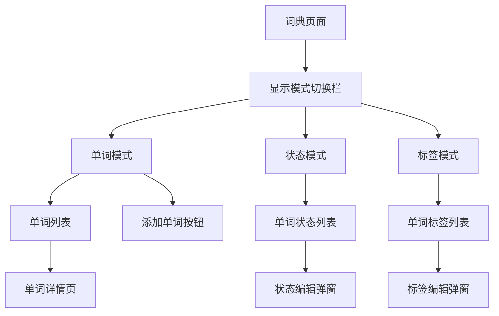

# 词典显示模式切换功能 - 产品需求文档

## 1. Product Overview
为英语词典应用增加显示模式切换功能，用户可以在单词、状态、标签三种显示模式之间切换，提供更丰富的单词管理和学习体验。
- 解决用户需要查看和管理单词学习状态、标签分类的需求，提供多维度的单词信息展示和编辑功能。
- 目标是提升用户的学习效率和单词管理便利性，为后续的个性化学习功能奠定基础。

## 2. Core Features

### 2.1 User Roles
本功能不涉及用户角色区分，所有已登录用户均可使用此功能。

### 2.2 Feature Module
词典显示模式切换功能包含以下核心模块：
1. **显示模式切换栏**：位于词典页面右上角的三选项切换控件
2. **单词模式**：默认模式，显示单词列表和详情
3. **状态模式**：显示单词学习状态，支持状态编辑
4. **标签模式**：显示单词标签信息，支持标签编辑

### 2.3 Page Details

| Page Name | Module Name | Feature description |
|-----------|-------------|---------------------|
| 词典页面 | 显示模式切换栏 | 提供[单词、状态、标签]三个选项的切换按钮，位于页面右上角，支持点击切换 |
| 词典页面 | 单词模式 | 默认模式，显示按字母分类的单词列表，点击进入单词详情页，显示添加单词浮动按钮 |
| 词典页面 | 状态模式 | 显示单词及其学习状态（如：未学习、学习中、已掌握），点击单词弹出状态编辑弹窗，隐藏添加单词按钮 |
| 词典页面 | 标签模式 | 显示单词及其标签信息，点击单词弹出标签编辑弹窗，支持添加、删除、修改标签，隐藏添加单词按钮 |
| 弹窗 | 状态编辑弹窗 | 显示当前单词的学习状态，提供状态选择器（未学习、学习中、已掌握等），支持保存修改 |
| 弹窗 | 标签编辑弹窗 | 显示当前单词的标签列表，支持添加新标签、删除现有标签、从预设标签中选择 |

## 3. Core Process

### 主要用户操作流程：

1. **模式切换流程**：用户进入词典页面 → 默认显示单词模式 → 点击右上角切换栏选择状态/标签模式 → 页面内容相应切换
2. **状态管理流程**：切换到状态模式 → 查看单词状态列表 → 点击单词 → 弹出状态编辑弹窗 → 修改状态 → 保存
3. **标签管理流程**：切换到标签模式 → 查看单词标签列表 → 点击单词 → 弹出标签编辑弹窗 → 添加/删除/修改标签 → 保存

## 4. User Interface Design

### 4.1 Design Style
- **主色调**：保持现有的紫色渐变主题（#7C3AED 到 #A855F7）
- **切换栏样式**：圆角矩形背景，选中状态使用白色背景+主色文字，未选中使用透明背景+白色文字
- **字体**：保持现有字体规范，切换栏使用14px字体
- **布局风格**：卡片式布局，保持现有设计语言的一致性
- **图标风格**：使用简洁的线性图标，状态用圆点表示，标签用标签图标表示

### 4.2 Page Design Overview

| Page Name | Module Name | UI Elements |
|-----------|-------------|-------------|
| 词典页面 | 显示模式切换栏 | 位于右上角，白色半透明背景，圆角矩形，三个选项水平排列，选中状态有明显视觉反馈 |
| 词典页面 | 状态模式列表 | 单词卡片右侧显示状态指示器（彩色圆点），未学习-灰色，学习中-黄色，已掌握-绿色 |
| 词典页面 | 标签模式列表 | 单词卡片下方显示标签列表，每个标签为小型彩色胶囊状按钮 |
| 弹窗 | 状态编辑弹窗 | 居中弹窗，白色背景，包含单词标题、状态选择器（单选按钮组）、确认取消按钮 |
| 弹窗 | 标签编辑弹窗 | 居中弹窗，白色背景，包含单词标题、当前标签列表、添加标签输入框、预设标签选择区域 |

### 4.3 Responsiveness
保持移动端优先设计，切换栏在小屏幕上自适应缩小，弹窗在移动端占据90%宽度，支持触摸交互优化。