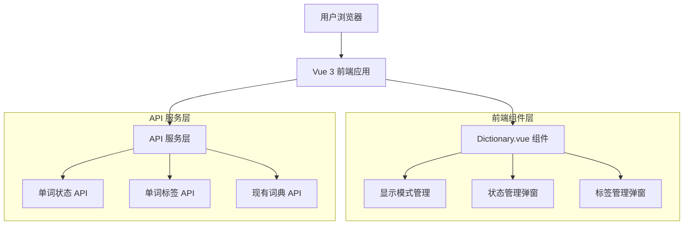
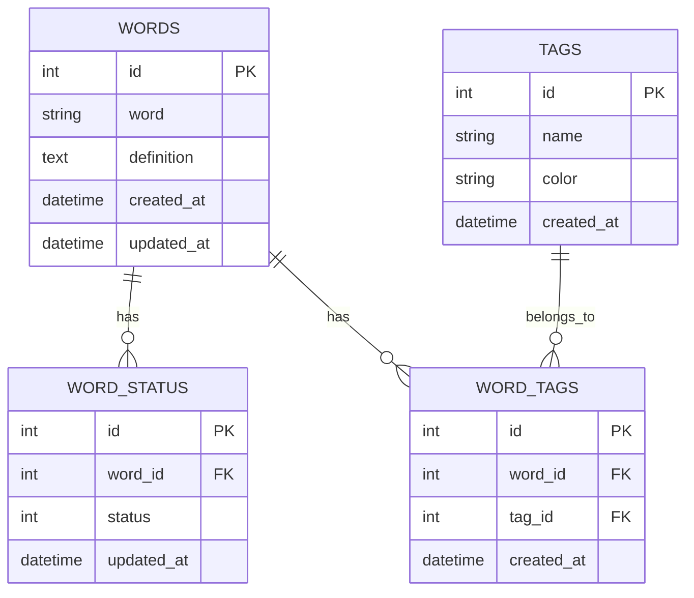

# 词典显示模式切换功能 - 技术架构文档

## 1. Architecture design



## 2. Technology Description

- Frontend: Vue@3 + Vant@4 + Vue Router@4
- Backend: 现有后端服务（需扩展状态和标签相关接口）
- 状态管理: Vue 3 Composition API (reactive, ref)

## 3. Route definitions

| Route | Purpose |
|-------|---------|
| /dictionary | 词典页面，包含新增的显示模式切换功能 |

注：此功能为现有词典页面的增强，不新增路由。

## 4. API definitions

### 4.1 Core API

#### 单词状态相关接口

获取单词状态列表
```
GET /api/dictionary/words/status
```

Request:
| Param Name| Param Type  | isRequired  | Description |
|-----------|-------------|-------------|-------------|
| offset    | number      | false       | 分页偏移量，默认0 |
| limit     | number      | false       | 每页数量，默认200 |

Response:
| Param Name| Param Type  | Description |
|-----------|-------------|-------------|
| code      | number      | 响应状态码，0表示成功 |
| data      | array       | 单词状态列表 |
| total_count| number     | 总数量 |

单词状态数据结构：
```json
{
  "id": 1,
  "word": "abandon",
  "status": 1,
  "status_name": "学习中",
  "updated_at": "2024-01-01T00:00:00Z"
}
```

更新单词状态
```
PUT /api/dictionary/words/{wordId}/status
```

Request:
| Param Name| Param Type  | isRequired  | Description |
|-----------|-------------|-------------|-------------|
| status    | number      | true        | 状态值：0-未学习，1-学习中，2-已掌握 |

#### 单词标签相关接口

获取单词标签列表
```
GET /api/dictionary/words/tags
```

Response:
```json
{
  "code": 0,
  "data": [
    {
      "id": 1,
      "word": "abandon",
      "tags": [
        {"id": 1, "name": "高频词", "color": "#FF6B6B"},
        {"id": 2, "name": "四级", "color": "#4ECDC4"}
      ]
    }
  ]
}
```

更新单词标签
```
PUT /api/dictionary/words/{wordId}/tags
```

Request:
| Param Name| Param Type  | isRequired  | Description |
|-----------|-------------|-------------|-------------|
| tag_ids   | array       | true        | 标签ID数组 |

获取预设标签列表
```
GET /api/dictionary/tags/preset
```

Response:
```json
{
  "code": 0,
  "data": [
    {"id": 1, "name": "高频词", "color": "#FF6B6B"},
    {"id": 2, "name": "四级", "color": "#4ECDC4"},
    {"id": 3, "name": "六级", "color": "#45B7D1"}
  ]
}
```

## 5. Data model

### 5.1 Data model definition



### 5.2 Data Definition Language

单词状态表 (word_status)
```sql
-- 创建单词状态表
CREATE TABLE word_status (
    id UUID PRIMARY KEY DEFAULT gen_random_uuid(),
    word_id UUID NOT NULL REFERENCES words(id) ON DELETE CASCADE,
    status INTEGER NOT NULL DEFAULT 0 CHECK (status IN (0, 1, 2)),
    updated_at TIMESTAMP WITH TIME ZONE DEFAULT NOW(),
    UNIQUE(word_id)
);

-- 创建索引
CREATE INDEX idx_word_status_word_id ON word_status(word_id);
CREATE INDEX idx_word_status_status ON word_status(status);

-- 状态说明：0-未学习，1-学习中，2-已掌握
```

标签表 (tags)
```sql
-- 创建标签表
CREATE TABLE tags (
    id UUID PRIMARY KEY DEFAULT gen_random_uuid(),
    name VARCHAR(50) NOT NULL UNIQUE,
    color VARCHAR(7) NOT NULL DEFAULT '#666666',
    created_at TIMESTAMP WITH TIME ZONE DEFAULT NOW()
);

-- 初始化预设标签
INSERT INTO tags (name, color) VALUES
('高频词', '#FF6B6B'),
('四级', '#4ECDC4'),
('六级', '#45B7D1'),
('考研', '#96CEB4'),
('托福', '#FFEAA7'),
('雅思', '#DDA0DD');
```

单词标签关联表 (word_tags)
```sql
-- 创建单词标签关联表
CREATE TABLE word_tags (
    id UUID PRIMARY KEY DEFAULT gen_random_uuid(),
    word_id UUID NOT NULL REFERENCES words(id) ON DELETE CASCADE,
    tag_id UUID NOT NULL REFERENCES tags(id) ON DELETE CASCADE,
    created_at TIMESTAMP WITH TIME ZONE DEFAULT NOW(),
    UNIQUE(word_id, tag_id)
);

-- 创建索引
CREATE INDEX idx_word_tags_word_id ON word_tags(word_id);
CREATE INDEX idx_word_tags_tag_id ON word_tags(tag_id);
```

权限设置
```sql
-- 为匿名用户授予基本读取权限
GRANT SELECT ON word_status TO anon;
GRANT SELECT ON tags TO anon;
GRANT SELECT ON word_tags TO anon;

-- 为认证用户授予完全权限
GRANT ALL PRIVILEGES ON word_status TO authenticated;
GRANT ALL PRIVILEGES ON tags TO authenticated;
GRANT ALL PRIVILEGES ON word_tags TO authenticated;
```